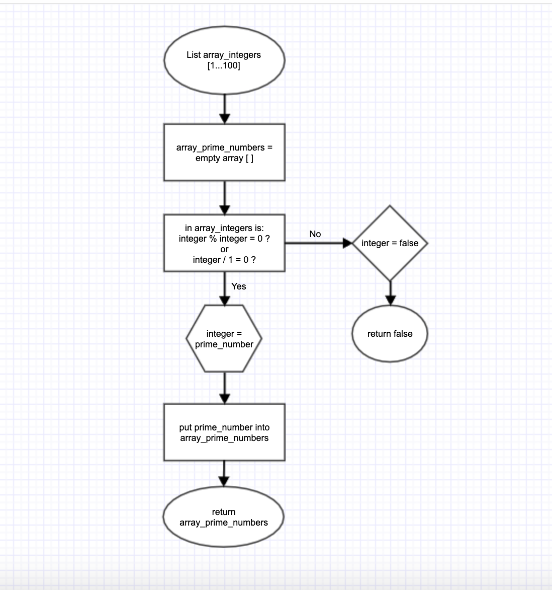

# T1A1 - Workbook 
By Stephanie Duffieux, March 2020

## Q1 - Development of the internet from 1980 to today


In 1980 Sir Timothy John Berners-Lee, an English engineer and computer scientist, later renowned for the invention of the World Wide Web and development of HyperText Markup Language (HTML), creates a hypertext software called ENQUIRE. This software was launched by the European Organisation for Nuclear Research, also known as CERN, to allow their scientists to keep track of people and their projects by the use of hypertext also commonly known as hyperlinks. The following year the NSF (National Science Foundation) granted the launch of the Computer Science Network (CSNET) to allow networking between its university computer scientists. 

In 1983 the Arpanet, known as the predecessor of the Internet, switches over to the Transmission Control Protocol (TCP) and Internet Protocol (IP) which remain the standard protocol for the internet today. These protocols were developed by Vinton Cerf who became known as the “Father of the Internet” and later received the “Nobel Prize of Computer Science” in 2004. That same year the Domain Name System (DNS) is created by Paul Mockapetris to allow an easier naming convention of websites rather than the use of standard numerical naming such as 126.546.289.20 which were hard to remember. The DNS uses the well known .com, .org, .net, .edu, .gov, etc. as naming extensions to identify websites. The first website to use DNS in 1985 is the “symbolic.com" website for the Symbolics Computer Corp in Massachusetts. 

In 1987 the number of internet hosts grows to around 30,000 hosts through the use of TCP/IP, this exceeds the number of hosts which were initially limited to 1,000 with the original Arpanet protocol. A few years later, in 1989, dial-up access to the internet is provided by world.std.com, known as the first commercial provider of the internet, and in 1990 HTML is developed and continues to be used today to develop modern websites. CERN officially introduces The World Wide Web to the public in 1991 and the use of the internet becomes popular in 1992 with the first upload of audio and videos files.

And so begins the commercial use of the internet by 1993 with the development of web browsers such as the Mosaic Web browser, created by Marc Andreesen and the number of online websites increases to 600. From 1994-1995 widely used web browsers are introduced to the internet by Netscape Communications, Microsoft and Yahoo!, and popular websites are launched such as amazon.com, Craigslist or eBay. The Netflix website is founded in 1997 by Reed Hastings and Marc Randolph as a service that sends its subscribers DVD rentals by mail and later becomes a major online streaming provider of movies, TV shows, documentaries with over 148 million subscribers by 2019. In 1998 Google is born and becomes the most popular search engine, it drastically changes the way the internet is used, and in 1999 AOL (America Online) the largest Internet access service at the time, purchases Netscape Communications, who were the pioneers of web navigation and e-commerce software.

In 2000, the vulnerability of websites are exposed by the first service attacks to hit Yahoo! and eBay, and in 2003 the SQL Slammer worm attacks websites worldwide in only just 10 minutes. That same year well known websites such as Myspace, Skype, Wordpress and then Facebook in 2004 are introduced to the internet. The Safari web browser, later widely used by Apple makes its mark in 2004. Youtube makes its appearance in 2005 and social media becomes popular from 2010 with Facebook reaching 400 million users worldwide and new social media sites are introduced such as Pinterest, Instagram and Twitter which go on to accumulate millions of users to this day.

From its beginnings to its modern use, the internet has dramatically changed the way we work and interact with the world around us, and will continue to innovate and influence our way of living.

## Q2 - Define the features of the following technologies and how they have contributed to the development of the internet:


#### Packets 

In 1964, Leonard Kleinrock at MIT published the first book on packet switching theory and how it could be used towards computer networking. In theory a packet, being used as a unit of data, would travel from one router to another on the internet by travelling through the Transmission Control (TCP) and Internet Protocol (IP) of a computer, which would divide the file into small chunks and assign it an IP address to which it would travel to. Once it would reach its destination it would be reassembled into its original state. As an example email messages would be passed from one network to another by passing the data of its content through the computers TCP/IP networks, which would then break down the message into smaller chunks of data called packets, assign a destination address to these packets, called IP address, and once passed over the internet the email would be reassembled into its original format.

#### IP addresses (IPv4 and IPv6)

An IP address, also known as Internet Protocol address, allows computers to communicate between each other over the internet. Each computer which is connected to the internet is assigned its own IP address which is identified by a set of numerical numbers. IPv4 was the first version of IP addresses and was used by the ARPANET in 1983. It is still widely used today and transports up to 94% of the internet traffic. The IPv6 was designed in 1994 by the Internet Engineer Taskforce to allow more address space than the IPv4. 


#### Router and routing

Routers were developed as devices that would enable packet information to pass from one computer network to another. A router will consider the destination IP address of a packet and calculate the most efficient way to forward the packet to its destination. 
Routing enables users to either access websites or data which is stored on remote networks or allows the broadcasting or forwarding of messages from a local network to an external network. Routing travels information through several Internet Providers before it reaches its destination

#### Domains and DNS

Domains were created to replace the numerical naming of websites which are known as IP addresses and to replace these with the commonly known website naming convention such as .com, .org, .gov, .net, etc. This allowed users of the internet to easily remember website names. Domain Name Systems (DNS), created in 1983 by Paul Mockapetris had for purpose to allow users to simply type in the name of a website, such as www.website.com to access its destination rather than using its standard IP address which was harder to remember. DNS is still used with the modern internet and easily allows domain owners to change from one web host to another without having to change the name of their website. DNS simply points the Domain to its new hosting provider’s servers. 

## Q3 - Define the features of the following technologies that are essential in terms of the development of the internet:


        - TCP
        - HTTP and HTTPS
        - web browsers (requests, rendering and developer tools)

        Explain how each technology has contributed to the development of client and server communication over the internet (50 - 150 words for each technology)


Clients and servers can be described as two types of machines that are used on the Internet. Machines which provide services to other machines are classed as servers and machines which use those services are classed as clients. For example a server may run a software for another machine (client) and that machine may use that software. Servers are not limited to one specific service, they can run multiple services at a time. A simplified way of defining the difference between servers and clients is to look at it this way: a client will send a request to a server and the server will send back a response.

#### TCP

TCP also known as Transmission Control Protocol is the process which enables packets to travel from one host to another. Packets are small chunks of information which are broken down into smaller elements so they can be transmitted from one computer to another over the internet. When packets are transferred over the internet the TCP's role is to assure they arrive to their destination and are compiled back into their original state. TCP was essentially developed to allow the US department of defence to transfer information by connecting computers to each other through a global network. TCP has contributed to the development of client and server communication over the internet by allowing information to pass from one end to another, this has revolutionised the way we communicate for work or in everyday life. A simple example using the basic act of sending an email requires a TCP to accept the email in small packets and to calculate how to send the packets to a destination using an IP address. Once it reaches the IP address the destination server will then accept the packets which will then be reassembled into the original email. 

#### HTTP and HTTPS

HTTP also known as Hypertext Transfer Protocol is the process through which information is transferred over the Internet from one browser to another. To transfer information over the Internet HTTP must convert the information into a binary language (computer language) which transforms text into 1's or 0's, for example 0 stands for "a", 1 stands for "b", 01 stands for "c" and so on. HTTP can be used to send images, text or sound but precaution must be observed when transferring sensitive information such as banking information, this is when HTTPS steps in. HTTPS is the secure version of HTTP, known as Hypertext Transfer Protocol Secure, which will encrypt the information before passing it over the Internet. HTTP and HTTPS are the common languages used to communicate between clients and servers and have become the protocol of use for all Internet browsers or softwares which require the Internet.

#### Web browsers (requests, rendering and developer tools)

Web browsers were developed in the 1980's when Tim Berners-Lee came up with the idea of HTML which later led to the development of the World Wide Web. Web browsers are rendering engines which enable us to access websites on the Internet from a server to a client by using HTTP or HTTPS to translate HTML into human language. The first commonly used web browser was known as Mosaic which was developed in the early 90's by the Mosaic development team and was quickly taken over in popularity by its competitor Netscape Navigator. Web browsers were widely used world wide, however the way they worked remaind unknown by most developers until open-source browsers such as Google Chrome were developed in 2008. Open-source browsers allowed us to view the source code of a browser and understand the way they worked as rendering engines. Web browsers contributed to the development of client and server communication over the internet by downloading information from servers and displaying them onto the client machine.

## Q4 - Identify THREE data structures used in the Ruby programming language and explain the reasons for using each.

#### Arrays

Arrays are data structures in Ruby which store objects or a list of items. An Array can contain different values, such as strings, integers, floats, hashes, symbols or other Arrays which are stored between square brackets and separated by commas. Arrays are very useful to store lists of items and to output these items by referring to their index position, with the first item of the Array starting at index 0, then the second item would be index 1, and so on. Items within an Array can be accessed, added or removed using iterators, such as the .each or .map iterators, or using class methods.

#### Hashes

Hashes are data structures in Ruby that similar to Arrays will store item objects, however unlike Arrays which store items by assigning an index value to those items, dependent on their order within the Array, Hashes store a collection of key-value pairs. Objects within a Hash can be accessed by calling the key(or symbol) of a value. Example :key => “value”, if we call :key the output will be “value”. Hashes can be considered as dictionaries that store a words(symbols) and their meanings(values), the meaning of the words can be accessed by calling the word rather than an index number like you would in an Array. 

#### Trees

Trees are data structures in Ruby that will store and output elements in a hierarchal way. The hierarchy of a Tree goes with the top node of the Tree called the root, descendants of the root are called children and the bottom node of the Tree, without children, called leaves, each element within a Tree is a node. There is no limits to the number of elements that can be stored within a Tree. In Ruby we can use Classes to navigate within a Tree structure and modify contents of the nodes by creating instances of a Class.

## Q5 - Describe the features of interpreters and compilers and how they are different.

Regardless of the programming language used to create source code, every language needs a translator just the same as different human languages are translated between humans. 

In machine language the translators of the source language are referred to as Compilers and Interpreters. Machine language is also known as object language and source language can be described in other words as a high level language written in human form.

There are however differences between Compilers and Interpreters and the source language used to create a program will determine which translator will be used. A Compiler will transform the source language into machine language as a whole and generally execute code faster, while an Interpreter will imitate the source language by executing the source language one line at a time. However, due to the nature of the way it executes code, a Compiler requires more memory than an Interpreter, therefore languages such as PHP, Phython, Ruby etc are often popular languages to use as they are executed by Interpreters.

#### How code is executed with a Compiler:

A Compiler is a program that will translate source language into machine language as a whole and report any error messages once it has generated the source code to the target program. The process of Compiling goes through six phases:

1. Lexical Analyser, which analyses the source code and outputs tokens that will identify the programming language that is being interpreted.
2. Syntax Analyser, which analyses the tokens which are transferred from the first phase and breaks it into parse trees.
3. Semantic Analyser, which analyses the parse trees from the previous phase and returns the values of each node within a tree.
4. Intermediate Code Generator, which creates a transitional code from the source code. The most commonly used is known as Three Address Code(TAC)
5. Code Optimiser, which will remove any code that is no longer required which will in return create more space and improve rendering time.
6. Code Generator, finally produces and outputs the code to the target program.    

* How code is executed with an Interpreter:

Unlike the Compiler which will interpret source code as a whole and run the code through several phases before it is output, an Interpreter will execute each line of code one at a time and will also produce error messages for each line. An Interpreter will perform three main phases which are lexing, parsing and type checking. This is often seen as an advantage for developers as it enables to rapidly locate and fix errors within the source code. The disadvantage is that an Interpreter will run slower in comparison to a Compiler.  

## Q6 - Identify TWO commonly used programming languages and explain the benefits and drawbacks of each.

#### Java 

Java is an object-orientated language that has been popular since its creation in the mid-90's, by James Gosling, and became a central element of Sun Microsystem's Java platform. Today it is still ranked as one of the most popular languages according to Tiobe (a company that specialises in assessing and tracking the quality of software) mainly due to the fact that the world's biggest companies use Java as their programming language to build their desktop applications and backend web systems. Some of the well known companies that reportedly use Java in their applications are Netflix, Spotify, Instagram and Twitter who is said to have moved from Ruby to Java due to the scaling advantages that are offered with the use of Java. Java is also popular due to its portability which allows it to run on almost every system. Java is also the main language used in the development of most Android applications. One very important factor that was highly taken into consideration in Java was its security, it was in fact one of the first languages to consider security when it was developed. As a whole, the advantages of using Java are overall its portability, scalability, security and popularity amongst developers and large companies. There are only a few disadvantages to using Java, which firstly would be that it is quite slower and will tend to use more memory than its fellow compiled languages such as C or C++ as it is run on top of Java Virtual Machine (JVM) and as such hardware costs are higher to use Java. Other than that, Java remains a go to language in the programming world.


#### Python

Python seems to have risen in popularity within the last fifteen years due to its flexibility of use from web applications, data analytics, artificial intelligence to robotics, to name a few. Google has largely contributed to the success of Python and has invested in it for the past decade. Python has also become one of the most popular programming languages to be taught in the USA mainly due to its simplicity and is often picked as a favourite programming language amongst senior developers. The simple syntax rules of Python makes it an easy to read language and therefore the code can easily be maintained and shared and manipulated amongst developers. Python is also a multi-paradigm programming language meaning it can be used in multiple ways, from functional concepts, aspect-orientated to dynamic type systems Python's advantage is that is can be used to build large and very complex software applications. Also with Python being an Interpreted language makes it compatibility with major platforms and systems without having to be recompiled. There are however a few disadvantages that can be noted with the use of Python, these mainly come down to speed (being a high level language, unlike C or C++, Python is slower), compatibility issues reported in mobile development, high memory consumption due to the variety of functions which can be performed with Python, runtime errors which requires more testing. Overall, Python is an easy to learn language and its pros can far outweigh its cons.

## Q7 - Identify TWO ethical issues and discuss the extent to which an IT professional is ethically responsible in terms of the issue.

Many developers are often unaware of how their knowledge and skills involve ethical issues. However, having the ability to access a person’s or company’s personal information or intellectual property gives much power to IT professionals who can intentionally or unintentionally misuse these, it’s therefore essential that they follow ethical guidelines. There is no formal ethical training in place for IT professionals, however these issues are addressed by various associations or organisations which were created to guide developers in the right direction. It’s also important to note that ethical issues are not related to legal obligations, an IT professional may chose to work in an ethically responsible way or may be bound by legal obligations, the two are however completely different.

#### Ethical issues pertaining to a user’s personal information:

The most common ethical issue involves an IT professional’s ability to access a user’s personal information such as private emails, internet monitoring,  screen captures, personal documents or photos stored on a user’s computer. Most times IT professionals who work within a company or organisation have rights and privileges that will enable them to access data on employees that are linked to a company network, they can also access a company’s confidential documents. Having access to these could potentially place an employee or company in a vulnerable position. This is when an IT professional should consider if their actions could potentially breach ethical guidelines or legal obligations. 

On a legal perspective, there is no law in Australia that clearly outlines an IT professionals legal obligations to protect a user’s personal information, however privacy is governed in limited ways by federal and state laws. All entities handling personal information must comply with these laws. The Privacy Act 1988 was also introduced to protect the privacy of individuals and is a good source of reference for IT professionals working within large corporations or Australian Government Agencies.


#### Ethical issues pertaining to intellectual property, copyright, and acknowledgement:

Often IT professionals will be able to access information relating to a user’s or company’s intellectual property, copyright and acknowledgment. With the use of the internet, most information can be accessed online with or without the user’s permission. It’s important for developers to become familiar with Australian Laws which relate to these and the ethical guidelines which are involved when using or obtaining a third party’s intellectual property or copyright. Australia has a well established legal system which protects a business or individual’s intellectual property, copyright and trademarks. These are used to prevent others from using a certain brand without permission and are punishable by law. Developers may be asked by an employer or client to create a software or website which will contain logos or content which may belong to another business or individual and it can often become an ethical issue that a developer must address. It is also important for a developer to acknowledge that it is their responsibility to comply with Australian or International laws which relate to these issues. A Developer can refuse to perform work that will breach Australian or International law or which may not fit within their ethical standards.


## Case Study

#### Hypothetical Case Study pertaining to a user's personal information, by Stephanie Duffieux:

Tom is a talented developer and has been offered a work contract by a large Australian corporation, Media Solutions, which wishes to hire him to maintain the system network within the IT department. Tom’s contract states his department supervisor as Mr Smith and that all work carried out must be reported to his direct branch supervisor Mr Doe, who works under Mr Smith’s supervision. His contract also outlines his legal obligations and a confidentiality agreement is also signed between him and his new employer. 

On his first day of work Tom is taken through the company induction process and an extensive walk through of all the company policies and procedures. One policy in particular mentions his obligations to conform with company privacy and personal information relating to staff and company confidential documents, Tom quickly reads through all the documentation, signs and returns these to his HR department for filing. He then spends the rest of the day settling into his new position and getting to know his new team members and supervisor.

Tom has now been in his role at Media Solutions for well over 6 months and he’s formed a great relationship with his supervisor Mr Doe and the rest of his colleagues. Everything seems to be going well until one day Mr Doe makes a request that Tom is to access and trace all of the company’s employees e-mails and interactions on the internet as well as implement a program within the company network which will automatically screenshot all employee screens at regular times throughout the day. According to Mr Doe, this is a direct request from Mr Smith who is wishing to monitor staff productivity. However, by performing this task Tom realises that he will be breaching the Privacy and Personal Information policy which he signed during his induction process and that any breach to this policy must be immediately reported to Mrs Brown who is the supervisor of the HR department. Tom also realises that in performing his duties that his actions and findings may potentially jeopardise his fellow colleague’s positions within the company as he may be monitoring and reporting findings that will negatively affect them. He’s not quite sure what do to do in this instance, should he inform Mr Doe of his hesitations to perform such duties or directly report this to Mrs Brown? It’s a conflicting situation as Tom has formed such a bonding relationship with Mr Doe and the rest of his colleagues and he’s not sure if he should simply do as he is told, after all this is a request from his direct supervisor, or should he worry about the ethical issues arising in this instance? Tom decides to conduct his own research and finds that there is no law in Australia that clearly outlines an IT professionals legal obligations to protect a user’s personal information, however privacy is governed in limited ways by federal and state laws. Tom decides in the end that the decision of whether he should perform his duties as requested or not comes down to his own professional judgment and ethical standards and therefore Tom decides to consult Mr Doe directly to inform him of his hesitations to perform such duties without a formal signed agreement between HR and all employees who formally acknowledge and approve that Tom is able to go ahead with the requested task.

Overall there is no formal code of ethics for IT professional’s, however dealing with these issues in an ethical way comes down to each individuals own ethical values and responsibilities to do the right thing. It is important to consider how our actions could potentially harm other individuals or company’s and to take these into account. A good starting source for developers would be to comply with codes of ethics and professional conducts outlined by professional organisations such as the Association for Computing Machinery (ACM), or to refer to Australian laws relating to each particular situation. 

## Q8 - Explain control flow, using an example from the Ruby programming language

Control flow is a main element of programming and web development. By using control flow we enable our application to run according to the conditions of the source code. In the Ruby programming language control flows are determined by the use of conditionals such as if/else/elsif statements, while loops, case statements using when/return etc. Often the user input will determine which element of a conditional is returned by using comparative operations such as "==" which evaluates if the user inputs something that is equal to that statement then the program will return that line of code. Other conditionals statements in Ruby can be used to control or alter the control flow of a program such as the break, next, redo, or retry statements.

## Q9 -Explain type coercion

Type coercion in computer science is the method of transforming one data type to another, as an example a string could be transformed into an integer, an integer into a float or vice versa. Without type coecion we could experience important malfunctions or bugs within our code. As an example, if a user is prompted to enter two numbers into a program using an external source, such as a keyboard or a database, the program could potentially translate that input as a different element to what is expected, numbers could be translated as strings when typed from an external source and this would result in the program concatenating strings instead of making a sum of numbers, example "6" + "6" would output "66". Taking Ruby as the programming language, we can avoid these malfunctions by explicitly telling our code to expect the input as a number. To do this we can use the .to_i method which turns a string into an integer or the .to_f method which changes it to a float. We can also reverse this method and call the .to_s method which would tell the program to expect a string.

## Q10 - Explain data types, using examples

In computer language, data types specifically tell the program how to treat inputs or outputs. Data types must be assigned within the code in order to avoid malfunctions or bugs within a program. Data types will allow the Interpreter or Compiler to distinguish how the program will be using each element. Common data types in programming languages are:

- Strings - a sequence of characters, example "Hello world!"
- Integers - whole numbers, example a = 3
- Floats - decimal numbers, example b = 1.5
- Booleans - true or false values, example a == true && b == false
- Arrays - list of elements which can be of the same data type or a mix of data types, example a = [1, "b", 2.5]

## Q11 - Here’s the problem: “There is a restaurant serving a variety of food. The customers want to be able to buy food of their choice. All the staff just quit, how can you build an app to replace them?”

        - Identify the classes you would use to solve the problem
        - Write a short explanation of why you would use the classes you have identified

To create an app which would replace staff in a restaurant serving food we would need to use Parent and Inheritance classes.

By using Parent classes this would enable us to pass parameters to Methods within the class, using the Initialise method, and to hold the main behaviours of the program. These behaviours would then be re-used by Inheritance classes which would share the behaviours of the Parent class with its own customised attributes. This would enable us to keep our code DRY, avoid repetition and accept user input.

## Q12 - Identify and explain the error in the code snippet below that is preventing correct execution of the program

```ruby

    celsius = gets
    fahrenheit = (celsius * 9 / 5) + 32
    print "The result is: "
    print fahrenheit
    puts "."
```

The reason the above code is producing an error is because the program is expecting the user input as a string and essentially we cannot include a string in a mathematical calculation, therefore if we were to enter the number 45 the program would produce the following error "undefined method `/' for "45\\n45\\n45\\n45\\n45\\n45\\n45\\n45\\n45\\n":String (NoMethodError)". In this instance we need to tell our code to expect the input as a number. To do this we can use the .to_i method which turns a string into an integer or the .to_f method which changes it to a float. By doing this the program will run without error.

#### Correct code:

```ruby
    celsius = gets.to_f
    fahrenheit = (celsius * 9 / 5) + 32
    print "The result is: "
    print fahrenheit
    puts "."
```

## Q13 - The code snippet below looks for the first two elements that are out of order and swaps them; however, it is not producing the correct results. Rewrite the code so that it works correctly.

```ruby
    arr = [5, 22, 29, 39, 19, 51, 78, 96, 84]
    i = 0
    while (i < arr.size - 1 and arr[i] < arr[i + 1])
        i = i + 1 end
    puts i
        arr[i] = arr[i + 1]
        arr[i + 1] = arr[i]
```
    

#### Rewritten code:

  This will output [5, 22, 29, 19, 39, 51, 78, 96, 84] swapping the first two elements 39 and 19 that are out of order. If we wanted to run through the whole array swapping all elements out of order we would change (n-4) to (n-1).

 ```ruby
    arr = [5, 22, 29, 39, 19, 51, 78, 96, 84]
    n = arr.length
  
    (n-4).times do |i|
        if arr[i] > arr[i+1]
          arr[i], arr[i+1] = arr[i+1], arr[i]
        end
    end
    p arr
```


## Q14 - Demonstrate your algorithmic thinking through completing the following two tasks, in order:

        1. Create a flowchart to outline the steps for listing all prime numbers between 1 and 100 (inclusive). Your flowchart should make use of standard conventions for flowcharts to indicate processes, tasks, actions, or operations
        2. Write pseudocode for the process outlined in your flowchart


#### Flow Chart:




#### Pseudocode:

```ruby
    array_integers = [1 to 100]
    prime_number = integer / 1 and itself (integer divisible by only 2 numbers)
    array_prime_numbers = [ ]

    in array_integers 
        if (integer % integer) or (integer / 1) == 0
        return prime_number
        else false
        end
    puts array_prime_numbers = [prime_number]
```

## Q15 - Write pseudocode OR Ruby code for the following problem:

    You have access to two variables: raining (boolean) and temperature (integer). If it’s raining and the temperature is less than 15 degrees, print to the screen “It’s wet and cold”, if it is less than 15 but not raining print “It’s not raining but cold”. If it’s greater than or equal to 15 but not raining print “It’s warm but not raining”, and otherwise tell them “It’s warm and raining”.

#### Response in pseudocode:

    raining is equal to boolean
    #temperature is equal to integer

    if raining is true and temperature is less than 15
        return "It's wet and cold"
    else if raining is false and temperature is less than 15
        return "It's not raining but cold"
    else if raining is false and temperature is equal to or over 15
        #return "It's warm but not raining"
    else 
        return "It's warm and raining"

#### Response in Ruby code:

```ruby
    def weather(raining, temperature)

        if raining == true && temperature < 15
            return "It's wet and cold"
        elsif raining == false && temperature < 15
            return "It's not raining but cold"
        elsif raining == false && temperature >= 15
            return "It's warm but not raining"
        else
            return "It's warm and raining"
        end
    end

    puts weather(true, 20)
    #will return "It's warm and raining"
```

## Q16 - An allergy test produces a single numeric score which contains the information about all the allergies the person has (that they were tested for). The list of items (and their value) that were tested are:

        - eggs (1)
        - peanuts (2)
        - shellfish (4)
        - strawberries (8)
        - tomatoes (16)
        - chocolate (32)
        - pollen (64)
        - cats (128)

        So if Tom is allergic to peanuts and chocolate, he gets a score of 34.

        Write a program that, given a person’s score can tell them:
        a) whether or not they’re allergic to a given item
        b) the full list of allergies.

#### Response:

To determine whether a person is allergic to a given item we need to create a Class (DefineAllergies) which will take an argument (score), then within that class we need to create a hash list (created as a constant so we can use it within the methods of the class) which will take the keys as the allergens and the  as scores. Within the class we need to create 2 methods, one will determine the total of allergens equal to the score and the second method will list a person's allergies taking the result from the first method and listing the keys from that result.

#### Ruby code:

```ruby
    class DefineAllergies

        attr_reader :score

        def initialize(score)
            @score = score
        end

        ListAllergens = { 
            "eggs" => 1,
            "peanuts" => 2,
            "shellfish" => 4,
            "strawberries" => 8,
            "tomatoes" => 16,
            "chocolate" => 32,
            "pollen" => 64,
            "cats" => 128
        }
    
        def allergic_to(allergens)
        ListAllergens[allergens.to_s] == ListAllergens[allergens.to_s] & score
        end
    
        def list_all_allergies
        ListAllergens.keys.select { |allergens| allergic_to(allergens) }
        end
    end


    puts "Please enter your score"
    score = gets.chomp
    allergy_result = DefineAllergies.new(score.to_i).list_all_allergies
    puts "According to your score, you're allergic to #{allergy_result}."
```

## References 
* Internet History Timeline: ARPANET to the World Wide Web
By Kim Ann Zimmermann & Jesse Emspak June 27, 2017 - https://www.livescience.com/20727-internet-history.html

* The History of the Internet in a Nutshell, William Craig, President of WebFX, Inc. - https://www.webfx.com/blog/web-design/the-history-of-the-internet-in-a-nutshell/

* Wikipedia, Tim Berners-Lee - https://en.wikipedia.org/wiki/Tim_Berners-Lee

* Internet Hall of Fame, Vinton Cert - https://internethalloffame.org/inductees/vint-cerf

* Internet Hall of Fame, Paul Mockapetris - https://internethalloffame.org/inductees/paul-mockapetris

* Wikipedia, Netflix - https://en.wikipedia.org/wiki/Netflix 

* CNET.com, AOL buys Netscape - https://www.cnet.com/news/aol-buys-netscape-for-4-2-billion

* Rus Shuler, Pomeroy IT Solutions - https://web.stanford.edu/class/msande91si/www-spr04/readings/week1/InternetWhitepaper.htm

* Search Networking, Margaret Rouse - https://searchnetworking.techtarget.com/definition/packet 

* Brief History of the Internet, Barry M. Leiner, Vinton G. Cerf, David D. Clark, Robert E. Kahn, Leonard Kleinrock, Daniel C. Lynch, Jon Postel, Larry G. Roberts, Stephen Wolff - https://www.internetsociety.org/internet/history-internet/brief-history-internet/

* Difference, Ipv4 & Ipv6, Guru99 - https://www.guru99.com/difference-ipv4-vs-ipv6.

* Search Networking, Margaret Rouse - https://searchnetworking.techtarget.com/definition/router

* Internet Routing, Technopedia - https://www.techopedia.com/definition/30410/internet-routing

* Beginners Guide, DNS, WPbeginner - https://www.wpbeginner.com/glossary/dns
WPbegginer - https://www.wpbeginner.com/beginners-guide/beginners-guide-what-is-a-domain-name-and-how-do-domains-work/

* How Stuff Works, Clients and Servers, Marshall Brain - https://computer.howstuffworks.com/web-server4.htm

* Webopedia, TCP (Transmission Control Protocol), Vangie Beal - https://www.webopedia.com/TERM/T/TCP.html

* Taltech, A brief overview of TCP/IP communications - https://www.taltech.com/datacollection/articles/a_brief_overview_of_tcp_ip_communications

* iZooto, Easy understanding of web protocols, HTTP and HTTPS - https://www.izooto.com/blog/understanding-http-https-protocols

* Technopedia, Web Browser - https://www.techopedia.com/definition/288/web-browser

* Internet.com, Web Browser Evolution - https://internet.com/web-101/web-browser-evolution/

* MDN Web Docs, How the Web Works - https://developer.mozilla.org/en-US/docs/Learn/Getting_started_with_the_web/How_the_Web_works

* Ruby 101 Data Structures - https://medium.com/the-renaissance-developer/ruby-101-data-structures

* Overview of data structures for Ruby by Jesus Castello - https://www.rubyguides.com/2019/04/ruby-data-structures/

* Ruby for Beginners - http://ruby-for-beginners.rubymonstas.org/built_in_classes/hashes.html

* Jessica G, Data Structures, Trees and Ruby - https://medium.com/@jessgreb01/data-structures-trees-and-ruby

* RubyDoc, Ruby Tree - https://www.rubydoc.info/github/evolve75/RubyTree/Tree/TreeNode

* Compiler vs Interpreter, Guru99 - https://www.guru99.com/difference-compiler-vs-interpreter.html

* Difference Between Compiler and Interpreter, Tech Differences - https://techdifferences.com/difference-between-compiler-and-interpreter.html

* Quora, Advantages and Disadvantages of Java, Archan Desai - https://www.quora.com/What-are-the-advantages-and-disadvantages-of-programming-in-Java

* Stackify, Most Popular Programming Languages of 2019, Ben Putano - https://stackify.com/popular-programming-languages-2018/

* Wikipedia, Java Programming Language - https://en.wikipedia.org/wiki/Java_(programming_language)

* Tiobe - https://www.tiobe.com/company/about/

* Java, Stackshare - https://stackshare.io/java

* Disadvantages of Java Language, GeeksforGeeks - https://www.geeksforgeeks.org/disadvantages-of-java-language/

* 10 most popular programming languages today, Larry Kim - https://www.inc.com/larry-kim/10-most-popular-programming-languages-today.html

* 7 Important Reasons Why You Should Use Python, Mindfire Solutions -https://medium.com/@mindfiresolutions.usa/python-7-important-reasons-why-you-should-use-python

* What are the drawbacks of Python?, Net-Information.com - http://net-informations.com/python/iq/disadvantages.htm

* Computer World, Ethical Issues for IT Security Professionals - https://www.computerworld.com/article/2557944/ethical-issues-for-it-security-professionals.html

* ACM Code of Ethics and Professional Conduct - https://www.acm.org/code-of-ethics

* Wikipedia, Privacy Law in Australia - https://en.wikipedia.org/wiki/Privacy_in_Australian_law

* OAIC, The Privacy Act - https://www.oaic.gov.au/privacy/the-privacy-act/

* Australian Trade and Investment Commission, Guide to investing - https://www.austrade.gov.au/International/Invest/Guide-to-investing/Running-a-business/Understanding-Australian-business-regulation/Australian-Intellectual-Property-laws

* Control Flow in Ruby, Sonia Dumitru - https://medium.com/@soni.dumitru/control-flow-in-ruby

* The beginners guide to type coercion, Tom McFarlin - https://code.tutsplus.com/articles/the-beginners-guide-to-type-coercion-what-is-coercion--cms-21917

* How to convert data types in Ruby, Brian Hogan - https://www.digitalocean.com/community/tutorials/how-to-convert-data-types-in-ruby

* Wikibooks, Programming Fundamentals - https://en.wikibooks.org/wiki/Programming_Fundamentals/Data_Types

* Tech Computer Science, Programming data types -  https://teachcomputerscience.com/programming-data-types/

* Khan Academy, Prime Numbers - https://www.khanacademy.org/math/pre-algebra/pre-algebra-factors-multiples/pre-algebra-prime-numbers/v/prime-numbers 

* Gliffy, Guide to Flowchart Symbols, from Basic to Advanced - https://www.gliffy.com/blog/how-to-flowchart-basic-symbols-part-1-of-3

